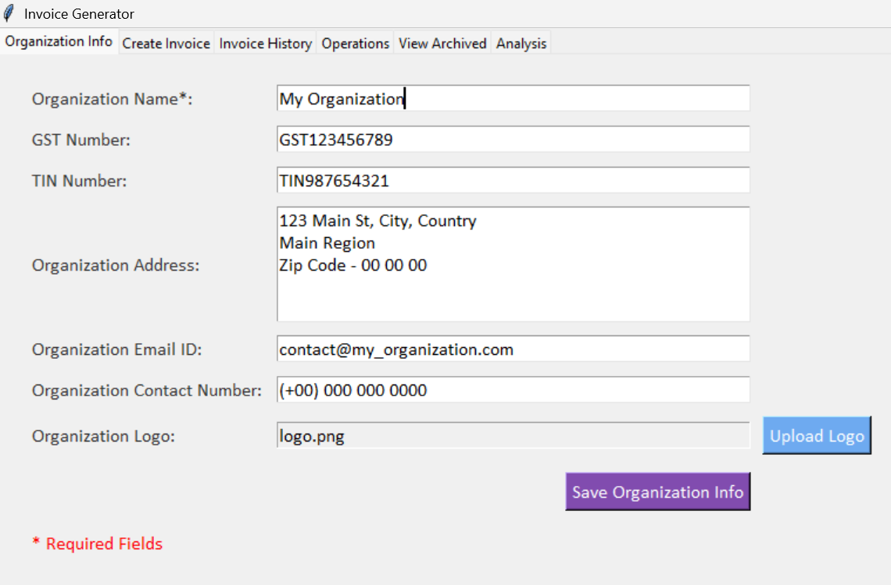
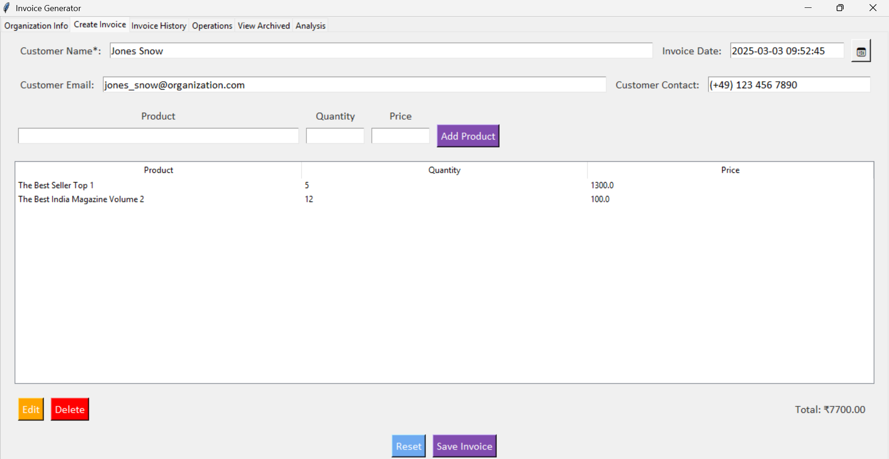
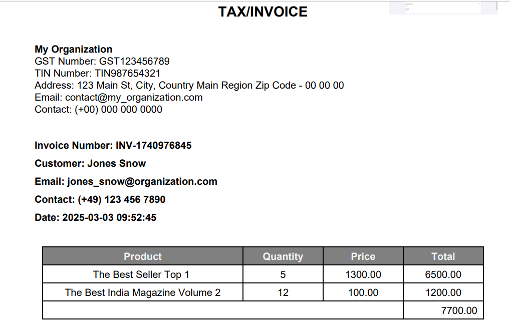
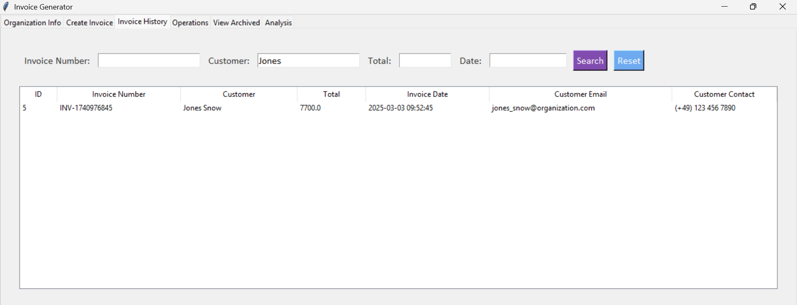
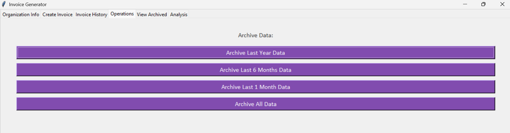
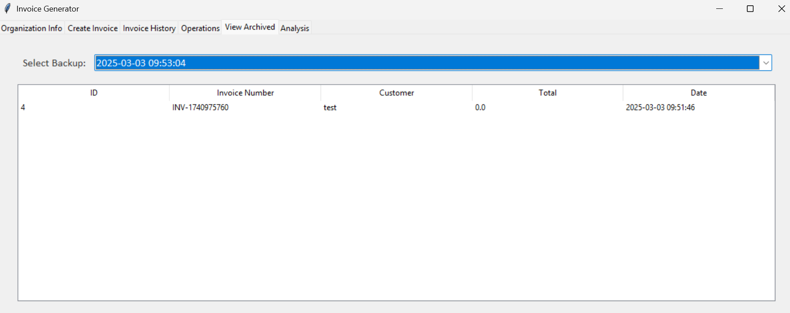
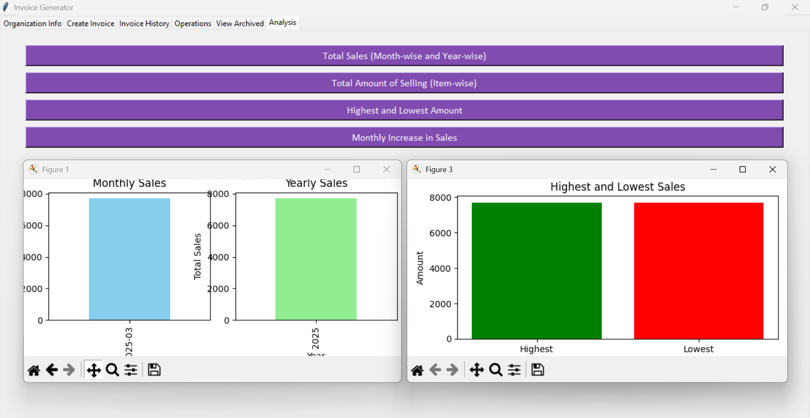

# Invoice Generator Application

The **Invoice Generator Application** is a desktop-based tool designed to create, manage, and analyze invoices efficiently. It features a user-friendly interface for generating professional invoices, archiving old data, and visualizing sales trends. Built with **Python** and **Tkinter** for the GUI, it uses **SQLite** for database management and **ReportLab** for PDF generation.

---

## 📌 Features

### 🔹 Create Invoices
- Add customer details (name, email, contact).
- Include multiple products with quantity and price.
- Automatically calculate the total amount.
- Generate and save invoices as PDFs.

### 🔹 Invoice History
- View all generated invoices in a tabular format.
- Filter invoices by invoice number, customer name, total amount, or date.
- Open and view PDF invoices directly from the application.

### 🔹 Organization Information
- Add and save organization details (name, GST number, TIN number, address, email, contact).
- Upload and display the organization logo on invoices.

### 🔹 Data Archiving
- Archive old invoices based on time periods (last year, last 6 months, last 1 month, or all data).
- View archived invoices and restore them if needed.

### 🔹 Data Analysis
- Visualize sales trends with interactive charts:
  - Monthly and yearly sales trends.
  - Item-wise sales breakdown.
  - Highest and lowest sales amounts.
  - Monthly sales growth.

### 🔹 User-Friendly Interface
- Clean and intuitive design.
- Easy navigation with tab-based functionalities.
- Real-time updates and input validations.

---

## 🛠️ Configuration

### 🔹 Prerequisites
Ensure you have the following installed on your system:
- **Python 3.x**
- Required Python libraries:
  
  ```bash
  pip install tkinter sqlite3 reportlab matplotlib pandas tkcalendar
  ```

### 🔹 Database Setup
The application uses **SQLite** for data storage. The database (`invoices.db`) is automatically created in the storage directory when the application is first run.

### 🔹 File Structure
```
invoice_app/
├── main.py                     # Entry point of the application
├── database.py                 # Handles database operations
├── gui.py                      # Handles GUI setup and layout
├── invoice_operations.py       # Handles invoice-related operations
├── organization_operations.py  # Handles organization-related operations
├── analysis.py                 # Handles data analysis and plotting
├── utils.py                    # Utility functions and constants
└── storage/                    # Directory for storing invoices and database
    ├── invoices.db             # SQLite database file
    └── invoices/               # Folder for storing generated PDF invoices
```

---

## 🚀 Running the Application

### 🔹 Clone the Repository
```bash
git clone https://github.com/your-username/invoice-generator.git
cd invoice-generator
```

### 🔹 Install Dependencies
```bash
pip install -r requirements.txt
```

### 🔹 Run the Application
```bash
python main.py
```

Alternative (Recommended)

```bash
python all_in_one_working_invoice_app.py
```

---

## 🎨 UI/UX Overview

The application provides a clean and intuitive interface with the following key features:

### 📌 **1. Organization Info Tab**
- Add and save organization details.
- Upload and display the organization logo.
- All fields are validated to ensure proper input.

### 📌 **2. Create Invoice Tab**
- Add customer details and products.
- Real-time calculation of the total amount.
- Reset or save the invoice as a PDF.

### 📌 **3. Invoice PDF**
- PDF generation of the invoice.
- Organization date including logo, name, address, email and contact.
- Consumer details including name, email and contact based on availability of the details.
- Display of purchase details and total amount.

### 📌 **4. Invoice History Tab**
- View all invoices in a table.
- Filter invoices by various criteria.
- Double-click to open and view the PDF invoice.

### 📌 **5. Operations Tab**
- Archive old invoices based on selected time periods.

### 📌 **6. View Archived Tab**
- View archived invoices and their details.

### 📌 **7. Analysis Tab**
- Visualize sales data with interactive charts.

---

## 🖼️ Screenshots
Here is reference snapshots of the portal pages - 

| Organization Info | Create Invoice | Invoice View | Invoice History |
|------------------|---------------|-----------------|-----------------|
|  |  |  |  |

| Operations | View Archived | Analysis |
|-----------|--------------|---------|
|  |  |  |

---

## 🤝 Contributing

Contributions are welcome! Follow these steps to contribute:

1. **Fork** the repository.
2. **Create a new branch** for your feature or bugfix.
3. **Commit** your changes and push to the branch.
4. **Submit a pull request**.

---

## 📜 License
This project is licensed under the **MIT License**. See the `LICENSE` file for details.

---

## 📧 Contact
For any questions or feedback, feel free to reach out:

🔗 GitHub: [bhargav-rathod](https://github.com/bhargav-rathod)

---

## 🙌 Acknowledgments
- Built with ❤️ using **Python, Tkinter, SQLite, and ReportLab**.
- Inspired by the need for a simple and efficient invoice management tool.

---
   
